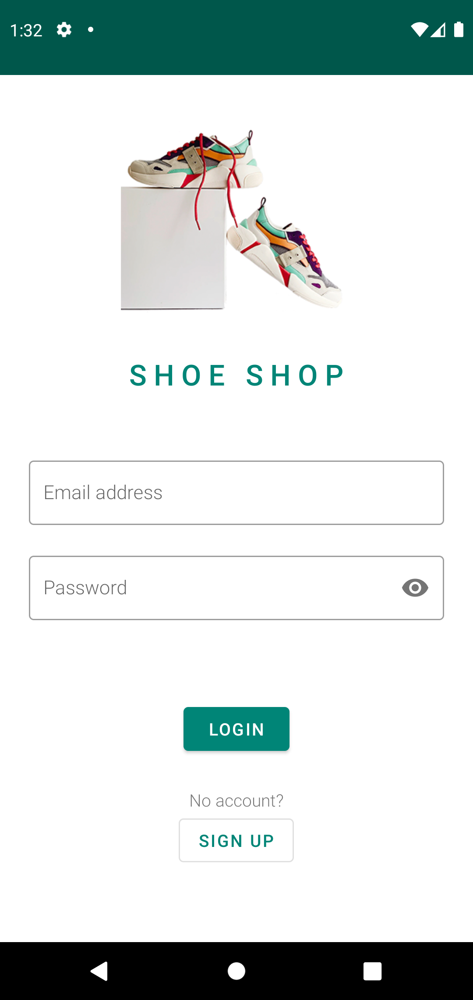
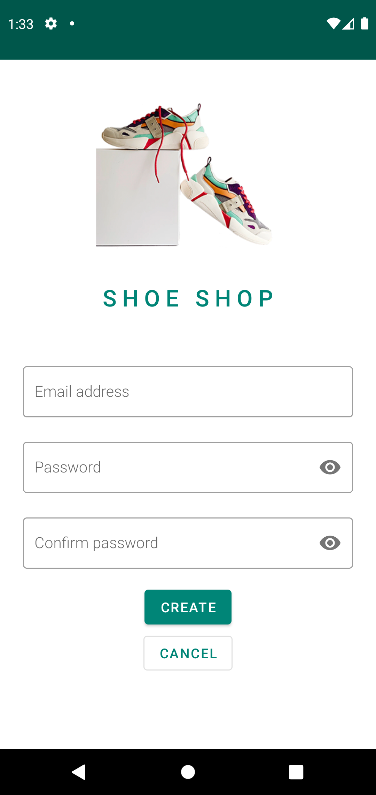
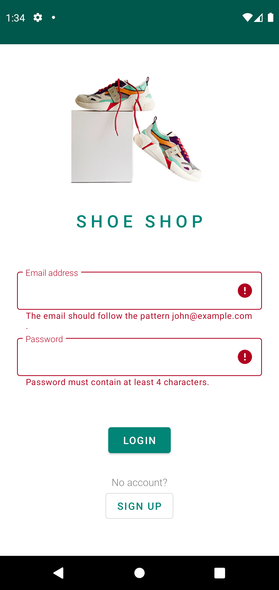
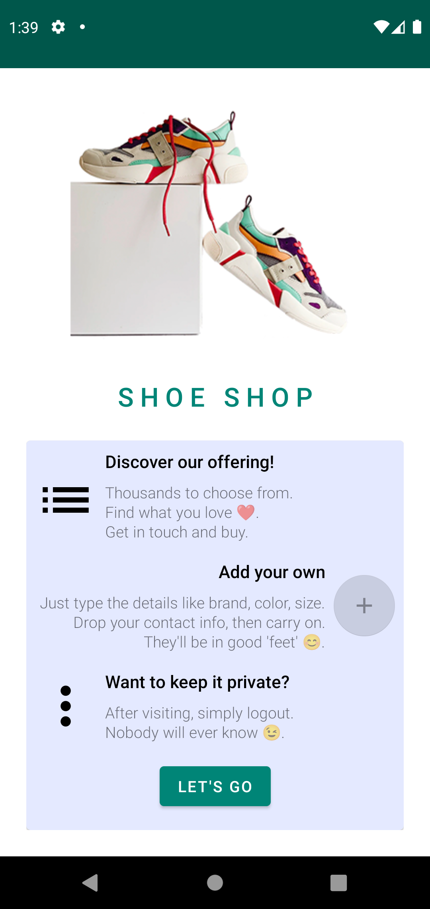
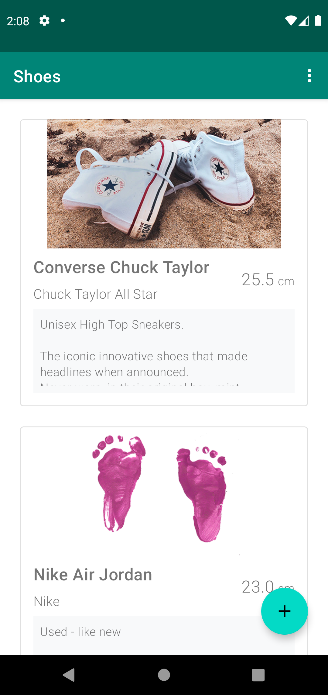
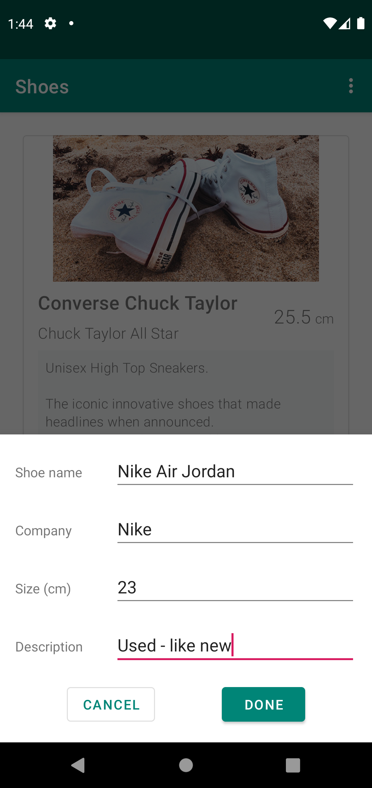

# The Shoe Store

**Shoe Store** is a mobile application which emulates the most basic functionalities for a digital store app. It contains five screens:

1. Login screen
2. Welcome onboarding screen
3. Instructions onboarding screen
4. Shoe Listing screen
5. Shoe Detail screen for adding a new pair of shoes

I developed this application as part of the Udacity's [Android Kotlin Developer Nanodegree](https://www.udacity.com/course/android-kotlin-developer-nanodegree--nd940) Program.
The main focus of this project was to apply the skills in building layouts and navigation files while following the **Single Activity architecture**.

In building the screens of the application, I implemented different Layout styles like LinearLayout and ConstrainLayout to match the complexity of the layout of the screen.

The app leverages the following components from the Jetpack library:

* [ViewModel](https://developer.android.com/topic/libraries/architecture/viewmodel)
* [LiveData](https://developer.android.com/topic/libraries/architecture/livedata)
* [Data Binding](https://developer.android.com/topic/libraries/data-binding/)
* [Navigation](https://developer.android.com/topic/libraries/architecture/navigation/)

This basic app lists the items by using ScrollView and LinearLayout. A new layout is created for each item upon saving the details and added programmatically as a child view to the LinearLayout.
The details of each item are saved to the ViewModel using Two-Way Data Binding.

## Application Flow
Take a look at the things you can do with this app:

# Login

# Onboarding
* Note - once on the List screen the user cannot go back to the Onboarding or Login screens by tapping on the "Back" button. Users can logout by accessing the contextual menu in the List screen.

# Items list + Adding a new item

## Get in touch
Reach out at [diana.sica29@gmail.com](mailto:diana.sica29@gmail.com)